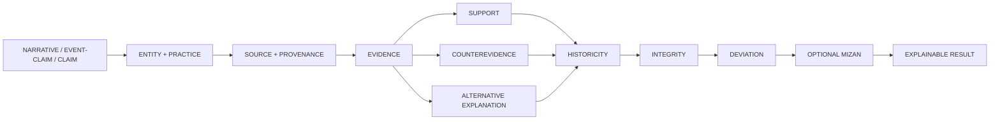

<div align="center">

# MFTL

## FROM MYTH FADES TO LEGEND

### **TRACE THE STORY · FIND THE SOURCE · WEIGH THE EVIDENCE**

A provenance-first **Narrative & Belief Intelligence Corpus** for mythology, folklore, supernatural claims, historical ritual traditions, information integrity, deviation, and explainable comparative analysis.

<br/>

[](https://github.com/bjo163/rocksoul-mftl/actions/workflows/validate.yml)


<br/>

**WORLD CORPUS · EVIDENCE GRAPH · SOURCE LINEAGE · NARRATIVE INTEGRITY · MIZAN**

[Explore the architecture](#the-intelligence-graph) ·
[Browse the corpus](#corpus-snapshot) ·
[Research queue](#research-queue) ·
[Read the method](docs/INDEX.md) ·
[View roadmap](docs/ROADMAP.md)

</div>

---

> **MFTL stores what the source says before storing what the analyst concludes.**

A myth can exist without being believed.  
A belief is not automatically a ritual.  
A ritual is not automatically worship.  
A false claim is not automatically a hoax.  
A deviation cannot exist without an explicit baseline.  
A textual attestation is not the same thing as empirical proof.

That separation is the foundation of MFTL.

## Rocksoul Research ownership

```text
MFTL       → STORY / NARRATIVE
LEGEND     → CANONICAL EVENT / HISTORICAL CORE
SUPERHERO  → PERSON / HUMAN AGENCY
RGBL       → TEXT / SCRIPTURE / REVELATION-REFERENCE
```

MFTL may describe **event reports, event claims, or events as narrated**, but canonical historical-event ownership belongs to LEGEND. Human actor/transmission ownership belongs to SUPERHERO. Exact scripture/text passages and their corpus provenance belong to RGBL.

[Read the interoperability contract →](docs/INTEROP.md)

## The intelligence graph



<div align="center">

### **DESCRIPTION ≠ VERDICT**

Every derived conclusion must remain traceable to claims, sources, evidence, uncertainty, and—when relevant—counterevidence.

</div>

---

## Four analytical layers

| | Layer | Purpose |
|---:|---|---|
| **01** | **MYTH / NARRATIVE** | Describe stories, entities, traditions, rituals, motifs, events, and claims without pre-judging them. |
| **02** | **INTEGRITY** | Detect misinformation, disinformation, fabrication, false attribution, misleading context, propaganda, and related epistemic distortions. |
| **03** | **DEVIATION** | Compare an observed text, teaching, practice, translation, or narrative against an explicit baseline. |
| **04** | **MIZAN** | Optional explainable normative/theological assessment attached to explicit evidence—not to cultures or populations. |

---

## Corpus snapshot

> Live counts are generated from `apps/web/public/data/corpus-index.json` on `main`.

<div align="center">


</div>

### First reviewed canonical graph

**Inana's Descent to the Netherworld**  
`MYTH-MES-INANA-DESCENT-000001`

```text
Sumerian composition
        │
        ├── 5 reusable entities
        ├── 5 atomic claims
        ├── 3 source records
        └── 6 evidence edges

Epistemic model:
supported_as_textual_attestation
≠
empirically proven supernatural event
```

The original discovery candidate is preserved as `merged`, so the path from discovery → research → canonicalization stays auditable.

---

## Research Queue

Research discovered by **MFTL Steward** goes to GitHub Issues first. It does **not** automatically become corpus truth.

```text
BROWSE
  ↓
RESEARCH ISSUE
  ↓
REVIEW
  ↓
CANDIDATE / CANONICAL / MERGE / REJECT
```

**[View open research →](https://github.com/bjo163/rocksoul-mftl/issues?q=is%3Aissue+is%3Aopen+%22%5BRESEARCH%5D%22)** ·
**[Create research issue →](https://github.com/bjo163/rocksoul-mftl/issues/new?template=research-data.md&title=%5BRESEARCH%5D+)**

A research issue should contain only six things: **topic, region/tradition, summary, sources, uncertainty, and suggested next action**.

## More than a mythology database

MFTL is designed around **18 record families**, including:

```text
NARRATIVE          ENTITY             CLAIM
PRACTICE           BELIEF / DOCTRINE  TEXT / TRANSMISSION
PROPHECY            PARANORMAL         PLACE / ARTIFACT
EVENT-REPORT        INTEGRITY          DEVIATION
PSEUDOKNOWLEDGE     MOVEMENT           SYMBOL / MOTIF
SOURCE / EVIDENCE   COMPARISON         ASSESSMENT
```

This allows the same graph model to investigate mythology, folklore, ritual, prophecy, textual drift, pseudohistory, hoaxes, manipulated narratives, and supernatural reports without forcing them into the same category.

---

## Evidence before certainty

MFTL avoids a single rhetorical `truth_score`.

Instead, the graph can preserve:

```text
CLAIM
 ├── supporting evidence
 ├── contradicting evidence
 ├── contextual evidence
 ├── alternative explanation
 └── unresolved uncertainty
```

Possible epistemic states include:

`supported_as_textual_attestation` ·
`supported_as_historical_attestation` ·
`probable` ·
`plausible` ·
`unverified` ·
`disputed` ·
`contradicted` ·
`fabricated` ·
`indeterminate` ·
`not_empirically_testable`

---

## Repository atlas

```text
rocksoul-mftl/
│
├── data/
│   ├── candidates/     discovery staging + merged provenance
│   ├── records/        canonical myth / narrative records
│   ├── objects/        general canonical MFTL objects
│   ├── entities/       reusable entity registry
│   ├── claims/         atomic claim registry
│   ├── sources/        reusable provenance registry
│   ├── evidence/       support / contradiction / alternatives
│   └── indexes/        corpus coverage metadata
│
├── schemas/            machine-valid JSON contracts
├── taxonomy/           record families + analytical taxonomies
├── docs/               research policy + architecture
├── apps/web/           React + Vite intelligence explorer
├── scripts/            validation + index generation
└── .github/            CI + issue intake
```

---

## Research pipeline


This repository intentionally uses **`main` as the only working branch**.

Automated research is **issue-first**: MFTL Steward browses, de-duplicates, and creates or updates a `[RESEARCH]` Issue. It does not directly add or canonicalize corpus research data. Small README/docs hygiene fixes may still be committed to `main` when useful and CI-safe.

---

## Research guardrails

MFTL prioritizes:

**primary texts → inscriptions / archaeology → peer-reviewed scholarship → university press → museums / libraries / archives → recognized institutional sources**

The project does **not**:

- fabricate or autocomplete citations;
- erase conflicting scholarship;
- promote weak discovery material into high-confidence fact;
- infer deceptive intent simply because a claim is false;
- use `myth` as a synonym for `lie`;
- call something `deviation` without defining the baseline;
- assign theological verdicts to living people, ethnicities, nationalities, or populations.

The theological layer is optional and remains separate from academic classification.

[Read the full research policy →](docs/RESEARCH_POLICY.md)

---

## Documentation

| Document | What it defines |
|---|---|
| **[Documentation Index](docs/INDEX.md)** | Entry point to all project contracts |
| **[Data Model](docs/DATA_MODEL.md)** | Core object and graph semantics |
| **[Record Families](docs/RECORD_FAMILIES.md)** | 18 extensible intelligence families |
| **[Narrative Integrity](docs/NARRATIVE_INTEGRITY.md)** | Hoax, fake-news, distortion, and deviation model |
| **[Research Policy](docs/RESEARCH_POLICY.md)** | Source quality, uncertainty, provenance, and dignity rules |
| **[Interoperability](docs/INTEROP.md)** | Ownership boundaries and links to LEGEND / SUPERHERO |
| **[Automation](docs/AUTOMATION.md)** | Main-only hourly research contract |
| **[Roadmap](docs/ROADMAP.md)** | Current and future milestones |

---

<details>
<summary><strong>Local development</strong></summary>

<br/>

```bash
git clone https://github.com/bjo163/rocksoul-mftl.git
cd rocksoul-mftl
npm install
```

Validate all machine contracts:

```bash
npm run validate
```

Generate the corpus explorer index:

```bash
npm run index
```

Run the research UI:

```bash
npm run dev
```

Build everything:

```bash
npm run build
```

</details>

<details>
<summary><strong>Stable identifier examples</strong></summary>

<br/>

| Object | Example |
|---|---|
| Canonical record | `MYTH-MES-INANA-DESCENT-000001` |
| Entity | `ENTITY-MES-INANA` |
| Claim | `CLAIM-MES-INANA-001` |
| Source | `SOURCE-ETCSL-INANA-DESCENT` |
| Evidence | `EVIDENCE-MES-INANA-001` |
| Integrity assessment | `INTEGRITY-...` |
| Deviation assessment | `DEVIATION-...` |

</details>

---

## Current horizon

```text
FOUNDATION            ████████████████████  READY
CANONICALIZATION      ███░░░░░░░░░░░░░░░░  ACTIVE
WORLD COVERAGE        ████████████░░░░░░░░  ACTIVE
SOURCE LINEAGE        ██░░░░░░░░░░░░░░░░░  VIA SUPERHERO
VERSION MUTATION      ██░░░░░░░░░░░░░░░░░  NEXT
PUBLIC EXPLORER       ███████░░░░░░░░░░░░░  ACTIVE
```

See **[the roadmap](docs/ROADMAP.md)** for acceptance criteria and upcoming milestones.

---

<div align="center">

## WHERE MYTH FADES TO LEGEND

### **TRACE · VERIFY · COMPARE · WEIGH · REVEAL**

**Not a list of gods. Not a list of verdicts.  
A traceable world evidence graph.**

`MFTL / rocksoul research`

</div>
